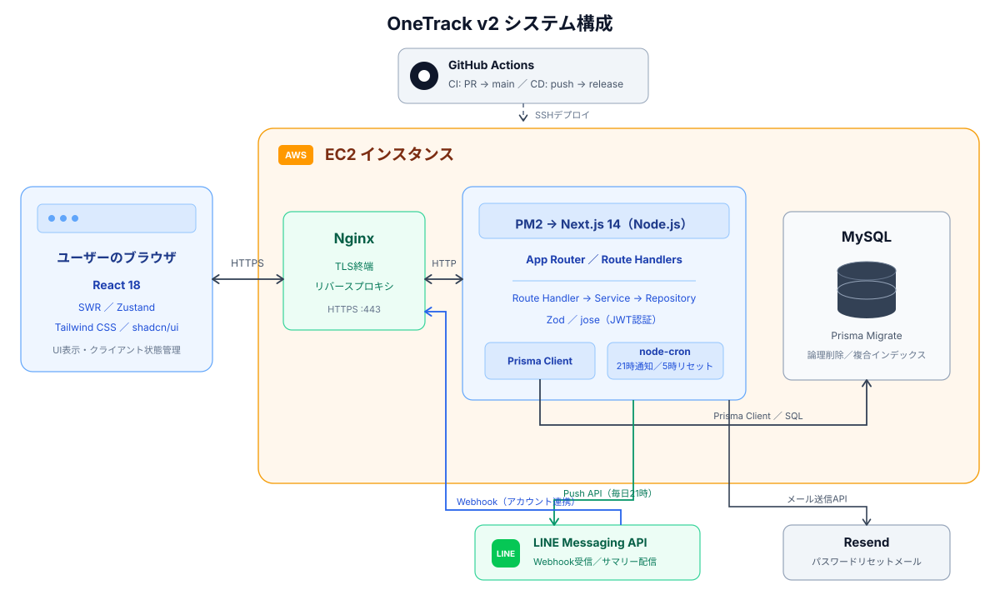
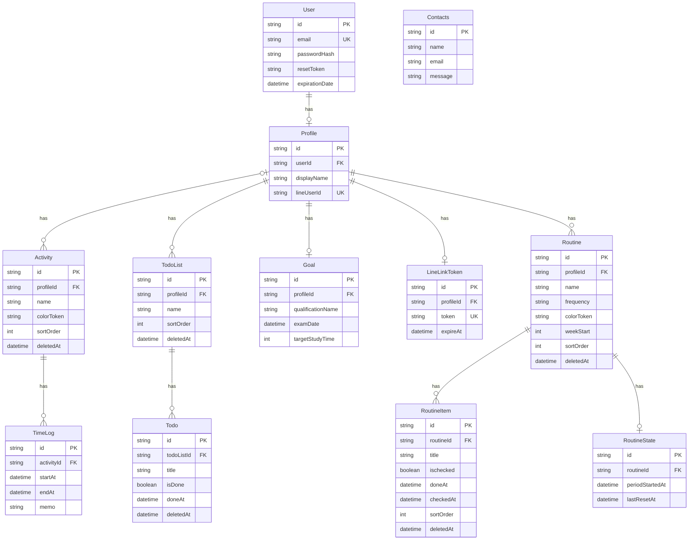

## ◽️ 利用者向け情報

**タイマー記録とTodo管理を同一画面にまとめ、学習時間の記録から月次の振り返りまで行えるWebアプリ「OneTrack (v2)」**

[アプリを試す](https://learning-track.com) ｜ [操作デモを見る（Loom）](https://www.loom.com/share/870cd9472a42497fb2e5c40a7f09a233)

> 登録不要のゲストログインで、デモデータをすぐに操作できます。


## 開発の背景

資格学習の際に使用していたモバイルアプリへの不満を、ひとつずつ自分で解決するために開発しました。

<table>
<tr><td>モバイルアプリでは学習中にスマホを手元に置かないといけない</td><td>→ <strong>PCブラウザで完結するWebアプリ</strong></td></tr>
<tr><td>既存アプリは決まった集計軸しか見られず物足りない</td><td>→ <strong>カテゴリ別・月別の学習時間を自分で集計・可視化するアナリティクス</strong></td></tr>
<tr><td>今日の予定を紙に書き、別で管理する必要があった</td><td>→ <strong>Todoを同一画面のサイドパネルに統合</strong></td></tr>
<tr><td>毎日の進捗が見えることがモチベーションだった</td><td>→ 予定のリマインドではなく、<strong>今日できたこと</strong>を毎晩LINE通知</td></tr>
</table>

## 機能紹介

| ログイン画面                                                                                                                                                                                                          | タイムライン画面                                                                                                                                                                                                                         |
| --------------------------------------------------------------------------------------------------------------------------------------------------------------------------------------------------------------------- | ---------------------------------------------------------------------------------------------------------------------------------------------------------------------------------------------------------------------------------------- |
|                                                                                                                                                                  |                                                                                                                                                                               |
| トップページ(/)のLPから遷移した後の画面です。**ゲストで見る**ボタンを設置し、登録不要の1クリックでデモデータ入りの環境を試せるようにしました。メール/パスワード認証・新規登録・パスワードリセットにも対応しています。 | 学習記録のメイン画面です。カテゴリを選んでワンクリックでタイマーを開始・停止でき、記録は時間軸上に色分け表示されます。リロードしても実行中タイマーは復元され、カテゴリ管理・メモ付き履歴（ページネーション付き）もこの画面で完結します。 |

| アナリティクス画面                                                                                                                                                                                 | Todoリスト（サイドパネル）                                                                                                                                                                     |
| -------------------------------------------------------------------------------------------------------------------------------------------------------------------------------------------------- | ---------------------------------------------------------------------------------------------------------------------------------------------------------------------------------------------- |
|                                                                                                                                      |                                                                                                                          |
| 月次の学習時間をカテゴリ別に棒グラフ・円グラフで可視化します。学習目標を設定すると、試験日までのカウントダウン・目標達成率・連続学習日数（ストリーク）が表示され、学習ペースを一目で把握できます。 | どの画面からでも開けるサイドパネルにTodoリストを設置し、タイマーで記録しながら今日のタスクを確認できます。複数リストの作成・切り替え・並び替え、Todoの追加・完了・編集・削除に対応しています。 |

| 設定画面                                                                                                                                                                  | LINE通知                                                                                                                                                                                |
| ------------------------------------------------------------------------------------------------------------------------------------------------------------------------- | --------------------------------------------------------------------------------------------------------------------------------------------------------------------------------------- |
|                                                                                                                        |                                                                                                                            |
| 表示名の編集、学習目標（資格名・試験日・目標学習時間）、LINE連携の設定をまとめた画面です。LINE連携は「友だち追加 → トークン発行 → トークで送信」の3ステップで完了します。 | 毎日21時に、その日の学習記録とTodo完了サマリーをLINEへ自動配信します（node-cronによるスケジュール実行）。「今日できたこと」が毎晩届くことで、学習継続のモチベーションにつなげています。 |

---

## ◽️ 開発者向け情報

前提: Node.js 22 / MySQL 8（CI・本番と同一バージョン）

<details>
<summary>セットアップ手順・環境変数</summary>

```bash
# 1. 依存パッケージのインストール
npm install

# 2. 環境変数の設定（.env.example をコピーして各値を設定）

cp .env.example .env

# 3. マイグレーション適用

npx prisma migrate dev

# 4. seed投入（ゲストユーザー・デモデータ）

npx prisma db seed

# 5. 開発サーバー起動 → http://localhost:3000

npm run dev

```

</details>

<details>
<summary>テスト</summary>

```bash
npm run test:run   # 単体テスト（Vitest）
npm run test:e2e   # E2E（Playwright、初回のみ npx playwright install が必要）
```

</details>

<details>
<summary>環境変数一覧</summary>

| 変数                                                | 用途                                     |
| --------------------------------------------------- | ---------------------------------------- |
| `DATABASE_URL`                                      | MySQLの接続文字列                        |
| `JWT_SECRET`                                        | JWT署名用のシークレット                  |
| `RESEND_API_KEY` / `EMAIL_FROM`                     | パスワードリセットメールの送信（Resend） |
| `GUEST_EMAIL` / `GUEST_PASSWORD`                    | ゲストログイン用アカウント（seedと一致） |
| `NEXT_PUBLIC_SITE_URL`                              | メール内リンクなどに使用するサイトURL    |
| `LINE_CHANNEL_ACCESS_TOKEN` / `LINE_CHANNEL_SECRET` | LINE Messaging API（通知配信・連携）     |
| `NEXT_PUBLIC_LINE_ADD_FRIEND_URL`                   | LINE友だち追加ボタンのURL                |

</details>

## 🛠️ 技術スタック

| カテゴリ       | 技術                                                      |
| -------------- | --------------------------------------------------------- |
| フレームワーク | Next.js 14 (App Router)                                   |
| 言語           | TypeScript 5                                              |
| ORM / DB       | Prisma 6 / MySQL                                          |
| バリデーション | Zod 4                                                     |
| データフェッチ | SWR                                                       |
| 状態管理       | Zustand                                                   |
| UI             | shadcn/ui + Radix UI + Tailwind CSS 3                     |
| 認証           | joseを用いたJWT認証フロー + bcryptjs                      |
| その他         | Recharts / React Hook Form / Resend / node-cron / winston |

**テスト・インフラ**: Vitest / Playwright / GitHub Actions（CI・CD）/ AWS EC2

## 🚀 システム構成・デプロイ



<details>
<summary>詳細</summary>

- **AWS EC2**（PM2 + Nginx + SSL）で運用。GitHub Actionsにより `release` ブランチへのpushを契機に自動デプロイされます。
- **CI**: `main` 向けPRで lint / 単体テスト / build / E2E（使い捨てMySQLコンテナ）を自動実行
- **CD**: デプロイ時のみGitHub ActionsランナーのIPをセキュリティグループの22番ポートに一時許可し、完了後に必ず削除（SSHポートを常時開放しない運用）
- seedでゲストユーザー・デモデータを投入し、レビュアーがすぐ試せる状態を担保

</details>

## 🗄️ データベース設計



<details>
<summary>詳細</summary>

※ `Routine` / `RoutineItem` / `RoutineState` はルーティン機能用のスキーマですが、機能自体は未実装です（詳細は「今後の改善」を参照）。

- `User` / `Profile` を軸に、`Activity` `TimeLog` `TodoList` `Todo` `Goal` `LineLinkToken` を紐づける構成
- `Activity`・`TodoList`・`Todo` に `deletedAt` を持たせ、ユーザー操作による削除を**論理削除**として実装
- 頻出クエリを **`EXPLAIN` で確認して複合インデックスを設計**
  - `TimeLog @@index([activityId, endAt])`：カテゴリ単位の期間検索・実行中タイマー検索用
  - `TodoList @@index([profileId, deletedAt, sortOrder])`：一覧取得時のfilesort解消を確認
  - `Todo @@index([todoListId, deletedAt, createdAt])`：リスト内Todo一覧（作成順）取得用
- 文字列カラムは用途に応じた `VARCHAR` 長を明示

</details>

**設計資料**: [ER図（Miro）](https://miro.com/app/live-embed/uXjVHNQ2Yso=/?embedMode=view_only_without_ui&moveToViewport=-854%2C-893%2C1548%2C1388&embedId=575390242521) / [画面遷移図（Figma）](https://www.figma.com/design/YJQt8LYCqSwFhkYdEs2MHG/%E3%82%AA%E3%83%AA%E3%82%B8%E3%83%8A%E3%83%AB%E3%82%A2%E3%83%97%E3%83%AA?node-id=0-1&t=l5ccdrvYg4QZij3C-1)

## 🏛️ アーキテクチャ

Next.js App Routerの実装に**レイヤードアーキテクチャ**を採用し、**Route Handler・Service・Repository**の3層に分けています。

<details>
<summary>詳細</summary>

### レイヤ構成

```
Route Handler   … Zodによる入力検証・HTTPステータスの決定
      ↓
Service         … ビジネスロジック
      ↓
Repository      … Prismaによる DB アクセス
      ↓
MySQL
```

### ディレクトリ構成

```
src/
├── app/
│   ├── api/               # Route Handlers（auth / timeline / todo-lists / todos /
│   │                      #   analytics / profile / line / contacts / goal）
│   ├── user/              # 認証済みページ（timeline / analytics / settings）
│   ├── signin/ signup/    # 認証ページ
│   ├── reset-password/ update-password/  # パスワードリセットフロー
│   ├── contact/           # コンタクトフォーム
│   ├── _lib/              # JWT発行・検証（jose）
│   └── _utils/            # Prismaクライアント / 認証ユーザー取得 / フォーマッタ
├── services/              # ビジネスロジック層
├── repositories/          # DBアクセス層（Prisma）
├── schemas/               # Zodスキーマ（API・フォーム共用）
├── types/                 # APIレスポンスのDTO型定義
├── store/                 # Zustand（ログインユーザー情報）
├── hooks/                 # 汎用フック（useDebounce / useLocalStorage、テスト付き）
├── components/            # shadcn/ui・フォーム共通コンポーネント
├── lib/                   # LINE Messaging API / winston logger / utils
├── middleware.ts          # JWT検証によるルート保護（ホワイトリスト方式）
└── instrumentation.ts     # node-cronの登録（サーバ起動時）
prisma/                    # schema / migrations / seed（ゲスト・デモデータ投入）
e2e/                       # Playwright E2E（認証フロー）
.github/workflows/         # CI（lint / test / build / E2E）・CD（EC2自動デプロイ）
```

</details>

## 💡 工夫したポイント

<details>
<summary>型安全・バリデーション</summary>

- Zodスキーマを**API入力検証とReact Hook Formのresolverで共用**し、検証ルールの二重管理を排除
- APIレスポンスのDTO型を `src/types/api.ts` に集約し、フロント/バックで同じ型を参照

</details>

<details>
<summary>セキュリティ</summary>

- JWTを **HttpOnly / Secure（本番環境） / SameSite=Strict** のCookieで管理。middlewareに認証不要パスを列挙し、**それ以外のページ・APIをJWT検証の対象**に設定
- ログイン失敗時はメール不存在・パスワード不一致とも**同一の401**を返却（アカウント列挙対策）

</details>

<details>
<summary>パフォーマンス</summary>

- Rechartsを**dynamic import**し、アナリティクス画面の初期JSを**220kB→106kB**に削減（当時の`next build`計測でのFirst Load JS比較、PR #29）
- LINE通知処理の**N+1を解消**：ユーザーごとに通知対象データを取得していた処理を `IN` 句による一括取得へ変更し、1回の通知処理あたり**1+N回→2回に固定**
- 履歴APIに**limit/offsetページネーション**を実装

</details>

<details>
<summary>テスト</summary>

- **Vitest**（Zodスキーマ・Service層・カスタムフックの単体テスト）＋ **Playwright**（認証フローのE2E）

</details>

## 🔭 今後の改善

- **Googleログイン（OAuth）**: 外部認証の導入でログインの手間を減らす
- **レスポンシブ対応・PWA通知**: スマホでの利用体験の底上げ
- **ルーティン機能**: Prismaスキーマに `Routine` 系モデルは定義済みだが、コア機能（タイマー・分析・通知）の完成度を優先するため、API・画面の実装はあえてスコープ外とした

## 📎 補足

> 本リポジトリは **EC2運用版**のver.2です。ver.1となる**Supabase×Vercel版** はこちら → [デモ画面](https://my-original-app-rho.vercel.app/) ｜ [GitHub](https://github.com/mizunatoma/OneTrack-v1-supabase)

> 学習の記録をまとめています → [学習ログ](https://html-vault-nu.vercel.app/)
